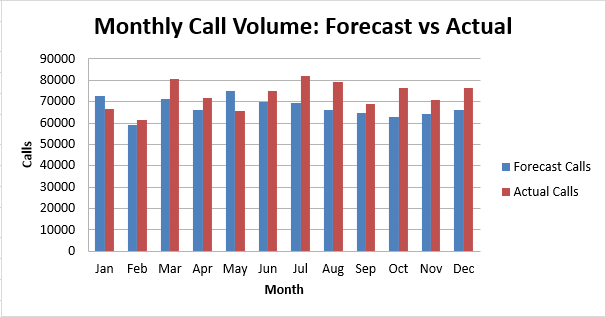
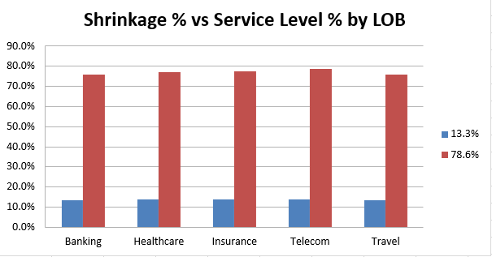

# 📊 WFM Data Analytics & Executive Dashboard

&gt; **Production-grade Workforce Management analytics engine** for a multi-client contact centre facing Service Level decline, high call-volume variance, and elevated shrinkage.

This project demonstrates end-to-end data engineering, KPI modelling, executive dashboard design, and operational risk identification using **Python, Pandas, and Excel**.

---

## 🖼️ Dashboard Previews

### Monthly Call Volume: Forecast vs Actual

### Shrinkage % vs Service Level % by LOB

---

## 📌 Business Scenario & Objective

A multi-client contact centre (2,500 agents across 6 LOBs and 6 sites) is experiencing:

- **Service Level (SL) decline** — currently at 77.3%, below the 80% industry standard
- **High call volume variance** — forecast accuracy is critically low at ~41%
- **Elevated shrinkage** — total shrinkage at 13.5%, uneven across LOBs
- **Data quality issues** — inconsistent LOB labels, duplicate agent logs, blank survey responses

**Goal:** Clean multi-source data, calculate core operational KPIs, design an executive dashboard, identify top operational risks, and recommend data-driven business actions.

---

## 📈 Key Company-Wide KPIs

| Metric | Overall Value | Target / Benchmark | Status | Key Impact |
| :--- | :--- | :--- | :--- | :--- |
| **Forecast Accuracy** | **41.39%** | ≥ 85% | 🔴 Critical | Major mismatch between forecasted vs actual call volumes — single biggest driver of SL misses |
| **Service Level %** | **77.32%** | ≥ 80% | 🟡 Below Target | Below industry standard; high daily variance risks SLA penalty exposure |
| **Total Shrinkage %** | **13.52%** | ≤ 12% | 🟡 Elevated | Combined planned + unplanned shrinkage eroding staffed capacity |
| **Occupancy %** | **76.82%** | 75–85% | 🟢 Healthy | Agent utilization sits in healthy band, but masks LOB-level imbalance |
| **Avg AHT** | **344.4 sec** | — | 🟡 Baseline | Average handle time across all intervals |
| **Avg CSAT** | **3.74 / 5.0** | ≥ 4.0 | 🟡 Moderate | Customer satisfaction benchmark |
| **Avg QA Score** | **82.26 / 100** | ≥ 85 | 🟡 Moderate | Quality audit score across all evaluations |

---

## 🏢 LOB-Level Breakdown

| LOB | Headcount | Forecast Accuracy | Shrinkage % | Occupancy % | Service Level % | Avg AHT (sec) | Avg CSAT | Avg QA |
|:---|:---:|:---:|:---:|:---:|:---:|:---:|:---:|:---:|
| **Banking** | 414 | 33.15% | 13.28% | 77.36% | 75.80% | 336.4 | 3.76 | 81.82 |
| **Healthcare** | 457 | 42.98% | 13.78% | 76.48% | 77.05% | 352.0 | 3.76 | 82.73 |
| **Insurance** | 371 | 38.88% | 13.75% | 76.73% | 77.55% | 342.3 | 3.75 | 82.43 |
| **Retail** | 443 | 42.23% | 13.26% | 76.62% | 78.60% | 339.9 | 3.73 | 82.26 |
| **Telecom** | 406 | 45.20% | 13.78% | 77.22% | 78.85% | 350.4 | 3.74 | 82.41 |
| **Travel** | 409 | 45.50% | 13.31% | 76.57% | 75.89% | 346.3 | 3.73 | 81.93 |

&gt; **Key Insight:** Banking has the worst forecast accuracy (33.1%) and lowest service level (75.8%), making it the highest-priority LOB for intervention.

---

## 🚨 Top 5 Operational Risks Identified

| Rank | Risk | Severity Score | Evidence | Business Impact |
|:---|:---|:---:|:---|:---|
| **1** | **Data quality gaps undermine reporting confidence** | 72.0 | Duplicates, inconsistent LOB spellings, SL% &gt; 100, blank CSAT responses detected | KPI trends need re-validation each cycle; dashboard risks being misread as more precise than it is |
| **2** | **Forecast accuracy is critically low** | 20.5 | Company-wide FA only 41.4% (range 33.1%–45.5% by LOB). Banking is worst at 33.1% | Understaffing during spikes drives SL misses & burnout; overstaffing wastes payroll. Single biggest lever behind SL decline |
| **3** | **Shrinkage is rising and uneven across LOBs** | 13.5 | Total shrinkage 13.5%; Telecom & Healthcare highest at ~13.8% | Every point of shrinkage erodes staffed capacity, compounding FA & SL problems |
| **4** | **Service Level is below target and unstable** | 0.8 | Overall SL 77.3% vs 80% target. Daily trend swings ~70–85% | Inconsistent CX, SLA penalty exposure, client churn risk for under-performing LOBs |
| **5** | **Occupancy masks LOB-level imbalance** | 0.7 | Company occupancy 76.8% sits in healthy band, but LOB spread is ~0.8pp | Hot LOBs risk agent burnout; cool LOBs carry idle cost. Both erode margin |

---

## 💡 Top 10 Business Recommendations

| # | Recommendation | Addresses Risk | Expected Benefit |
|:---|:---|:---:|:---|
| 1 | Rebuild forecasting model using LOB-level seasonality & trend; re-forecast weekly with rolling accuracy review | 1 | Directly targets the ~59% accuracy gap, the single largest lever on SL |
| 2 | Introduce forecast accuracy SLA/target (&gt;85% at LOB level) with named owner and monthly variance review | 1 | Creates accountability and early-warning before SL is impacted |
| 3 | Move weakest-SL LOBs to real-time intraday management (30-min re-forecast triggers) | 2 | Stabilises SL for lowest-performing, highest-penalty LOBs |
| 4 | Set explicit SL floor (e.g. no interval below 70%) with intraday escalation playbook | 2 | Reduces volatility seen in daily SL trend and limits worst-case CX impact |
| 5 | Investigate root causes of highest shrinkage LOBs (training vs unplanned leave) and rebalance scheduling to low-volume periods | 3 | Targets highest-shrinkage LOBs specifically rather than blanket fixes |
| 6 | Set shrinkage budget per LOB in staffing model instead of single blended assumption | 3 | Improves staffing accuracy, compounding with better forecasting to lift SL |
| 7 | Fix data capture at source: enforce single LOB dropdown and add unique-key constraint on (EmpID, Month) | 4 | Prevents duplicate records and spelling errors from recurring |
| 8 | Add validation rule rejecting SL% &gt; 100% and follow up on CSAT non-response rate | 4 | Removes manual capping need and increases trust in downstream KPIs |
| 9 | Roll out LOB-level (not just company-level) staffing and occupancy targets, reviewed monthly | 5 | Surfaces and manages LOB-level imbalance the company average currently hides |
| 10 | Stand up weekly Executive Dashboard review cadence with LOB/Site filters | 1,2,3,5 | Gives leadership one shared, current view for faster decision-making |

---

## ⚙️ Project Implementation & Methodology

### 1. Data Cleaning & QA
- **LOB standardisation:** Mapped variants like `" Retail"`, `"banking"`, `"health care"` to canonical categories (`Retail`, `Banking`, `Healthcare`)
- **Deduplication:** Collapsed duplicate `(EmpID, Month)` records in Shrinkage and QA_CSAT by averaging numeric fields
- **Validation:** Capped Service Level % at 100% (logically impossible values), flagged blank CSAT responses (left blank — not imputed)
- **Dimension join:** Ensured Shrinkage & QA_CSAT have LOB/Site via Employees master lookup

### 2. KPI Calculations
All KPIs computed with transparent, reusable formulas:

| KPI | Formula |
|:---|:---|
| **Forecast Accuracy** | `1 − (Σ|Forecast − Actual| / Σ Forecast)` |
| **Total Shrinkage %** | `Avg(Planned %) + Avg(Unplanned %)` |
| **Service Level %** | `Avg of interval-level SL%` |
| **Occupancy %** | `Avg of interval-level Occupancy %` |
| **AHT** | `Avg(Actual AHT)` |
| **CSAT** | `Avg(CSAT)` with `skipna=True` |
| **QA Score** | `Avg(QA Score)` |

### 3. Pivot Tables
Dynamic aggregations using group-by logic (equivalent to Excel `SUMIFS` / `AVERAGEIFS`):
- **By LOB:** Headcount, Salary, Experience, Shrinkage, CSAT, QA, NPS
- **By Site:** Same metrics across 6 physical sites
- **By Month:** Monthly trend of Forecast Accuracy, Shrinkage, Training, Leave, CSAT, QA, NPS

### 4. Executive Dashboard
Built datasets for:
- **KPI Cards:** 9 executive summary metrics
- **Volume Trend:** Monthly Forecast vs Actual calls
- **SL Trend:** Daily Service Level % over the interval period
- **LOB Scatter:** Shrinkage % vs Service Level % by LOB

### 5. Risk Analysis
Weighted severity scoring using configurable weights:
- Forecast Accuracy: 35%
- Service Level: 25%
- Shrinkage: 20%
- Data Quality: 12%
- Occupancy Balance: 8%

---

## 🏗️ Architecture
┌─────────────┐     ┌─────────────┐     ┌─────────────┐
│ DataLoader  │────▶│ DataCleaner │────▶│KPI Calculator│
│  (5 sheets) │     │(Audit Log)  │     │ (9 KPIs)     │
└─────────────┘     └─────────────┘     └──────┬──────┘
│
┌────────────────────────────────────────┘
▼
┌──────────────┐  ┌──────────────┐  ┌─────────────┐  ┌──────────────┐
│ PivotEngine  │  │DashboardBuilder│  │RiskAnalyzer │  │Recommendation│
│ (LOB/Site/   │  │ (KPI Cards +  │  │ (Top 5)     │  │   Engine     │
│   Month)     │  │  Trend Data)  │  │             │  │  (10 Actions) │
└──────┬───────┘  └──────┬───────┘  └──────┬──────┘  └──────┬───────┘
└─────────────────┴─────────────────┴────────────────┘
│
▼
┌──────────────┐
│ReportExporter│
│ (16 Sheets)  │
└──────────────┘
